<div align="center">

# Kawe Longon · Interactive Portfolio

**A brutalist, terminal-flavoured portfolio for a front end developer who also ships the layer behind the interface.**

[**kawelongon.netlify.app**](https://kawelongon.netlify.app)


<br>

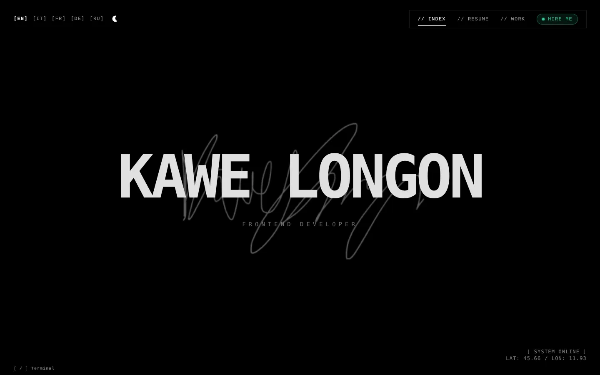

</div>

<br>

## Contents

[Gallery](#gallery) · [Features](#features) · [Tech stack](#tech-stack) · [Getting started](#getting-started) · [Contact form and email](#contact-form-and-email) · [Project structure](#project-structure) · [Adding content](#adding-content) · [Performance](#performance) · [Deploying](#deploying-on-netlify)

<br>

## Gallery

### Resume

A photo, a short pitch, key figures, then experience, projects, education, stack and languages. Section titles stay pinned while you scroll on a phone.

<table>
  <tr>
    <td>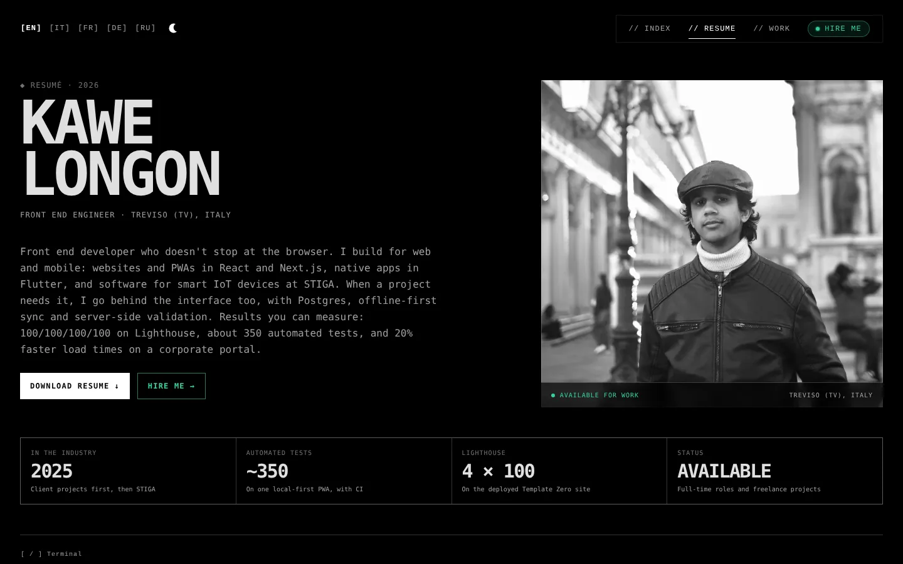</td>
    <td>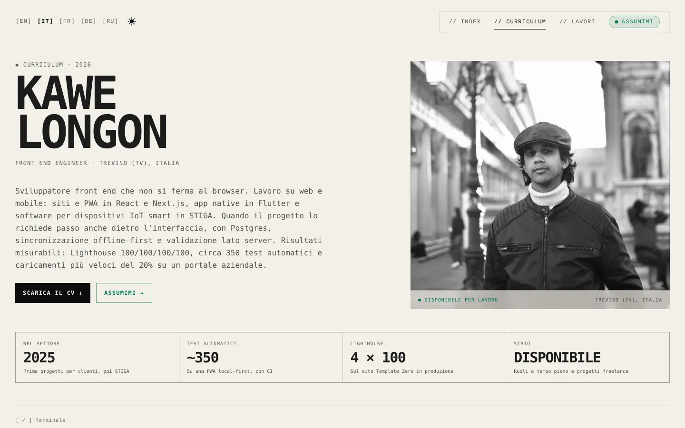</td>
  </tr>
  <tr>
    <td align="center"><sub>Dark</sub></td>
    <td align="center"><sub>Light, in Italian</sub></td>
  </tr>
</table>

### Work and case studies

Hover (or focus) a row and its screenshot follows the cursor. The title then travels into the case study page.

<table>
  <tr>
    <td>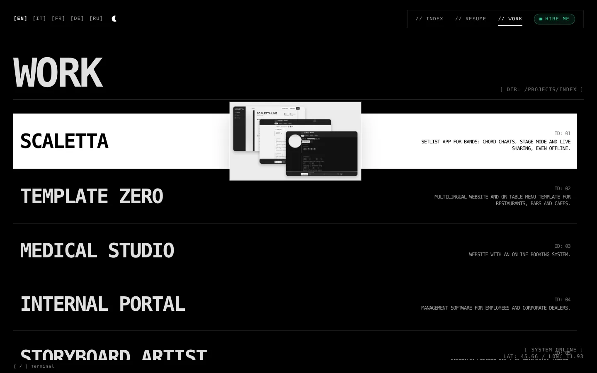</td>
    <td>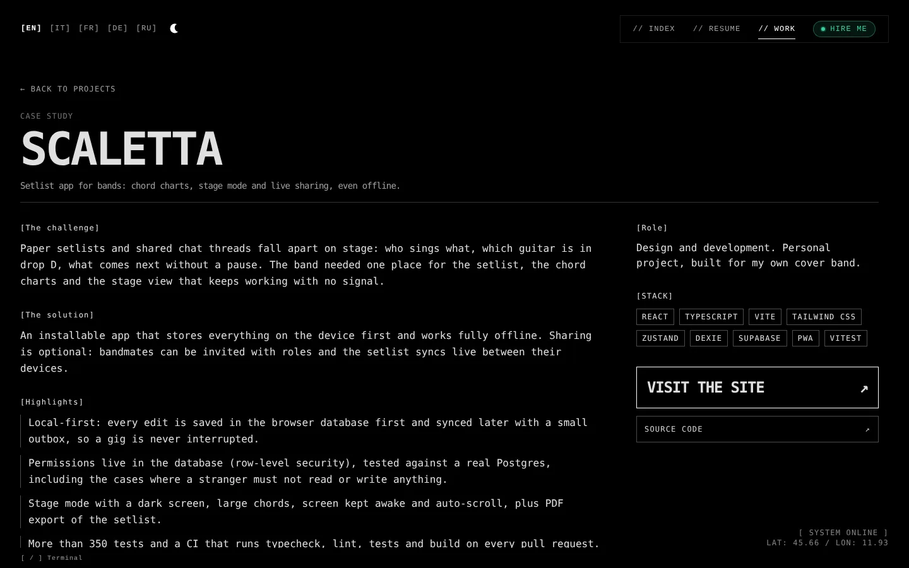</td>
  </tr>
  <tr>
    <td align="center"><sub>Work list with floating preview</sub></td>
    <td align="center"><sub>Case study: challenge, solution, highlights, stack</sub></td>
  </tr>
</table>

### Hire me and terminal

<table>
  <tr>
    <td>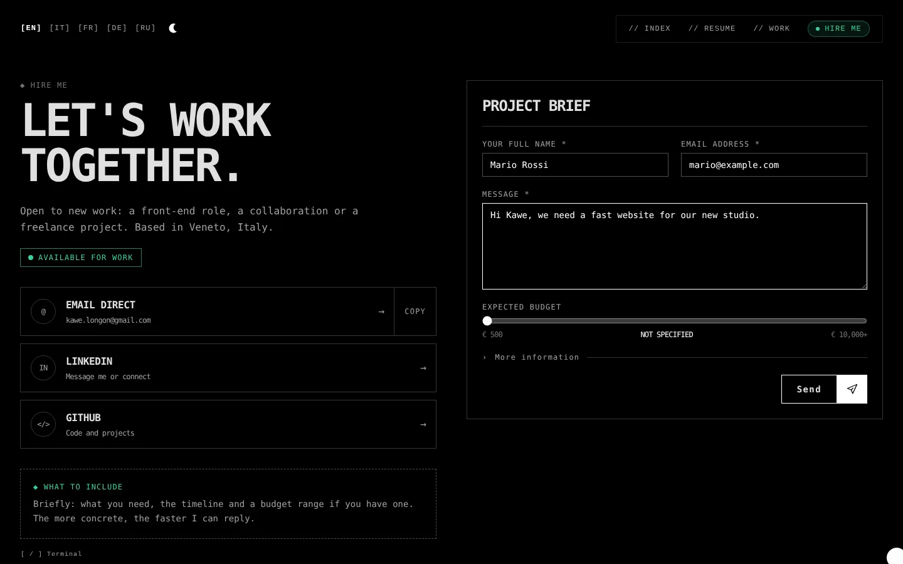</td>
    <td>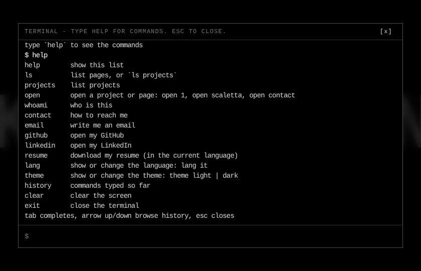</td>
  </tr>
  <tr>
    <td align="center"><sub>Project brief form</sub></td>
    <td align="center"><sub>Press <code>/</code> and type <code>help</code></sub></td>
  </tr>
</table>

### Light and dark

<table>
  <tr>
    <td></td>
    <td>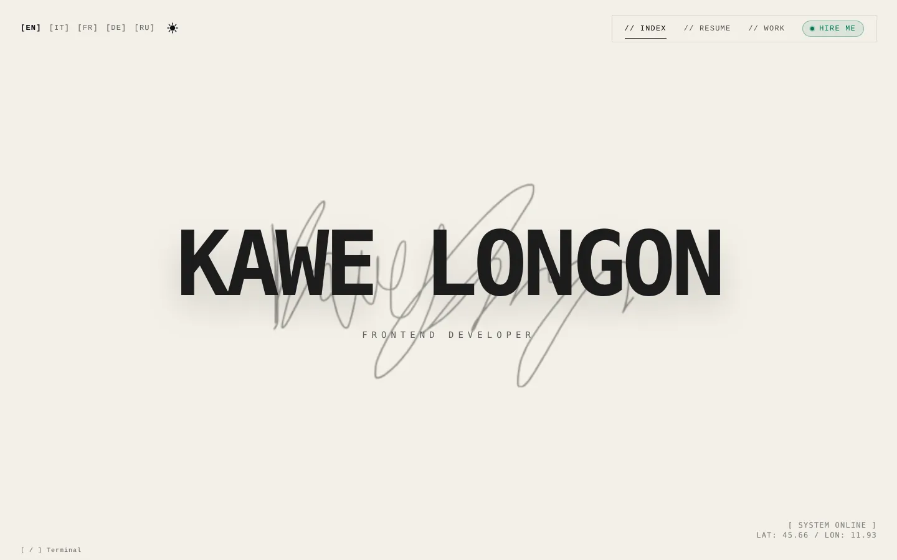</td>
  </tr>
</table>

### On a phone

<table>
  <tr>
    <td>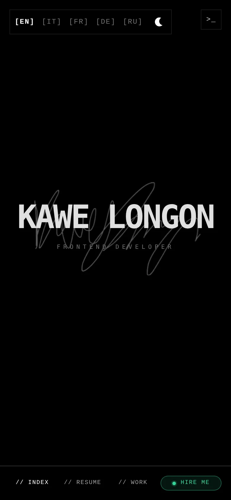</td>
    <td>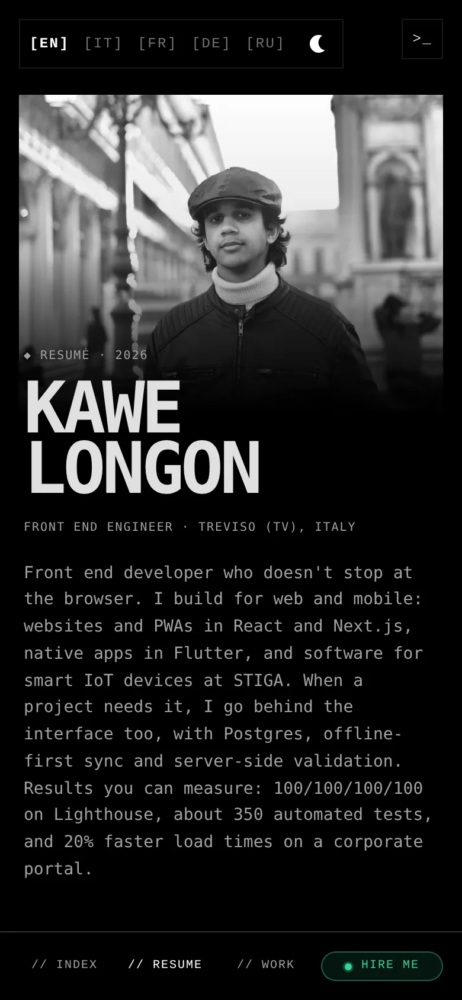</td>
    <td>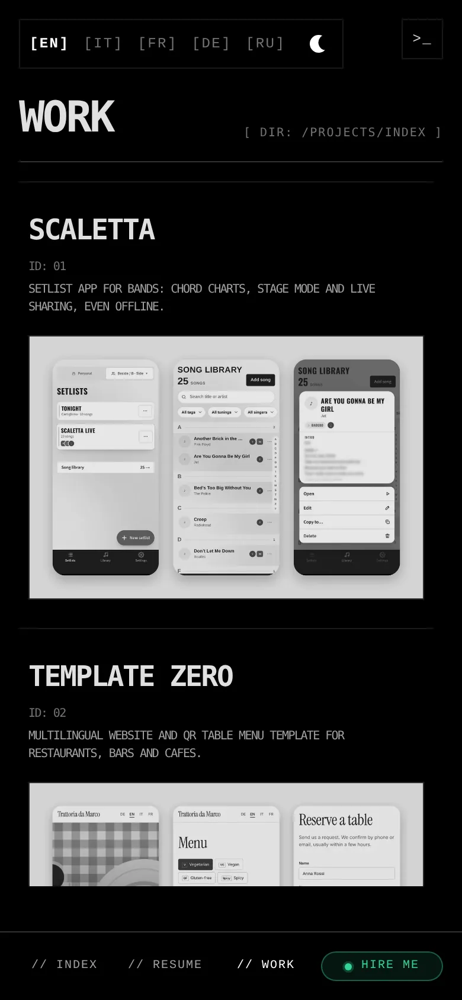</td>
    <td>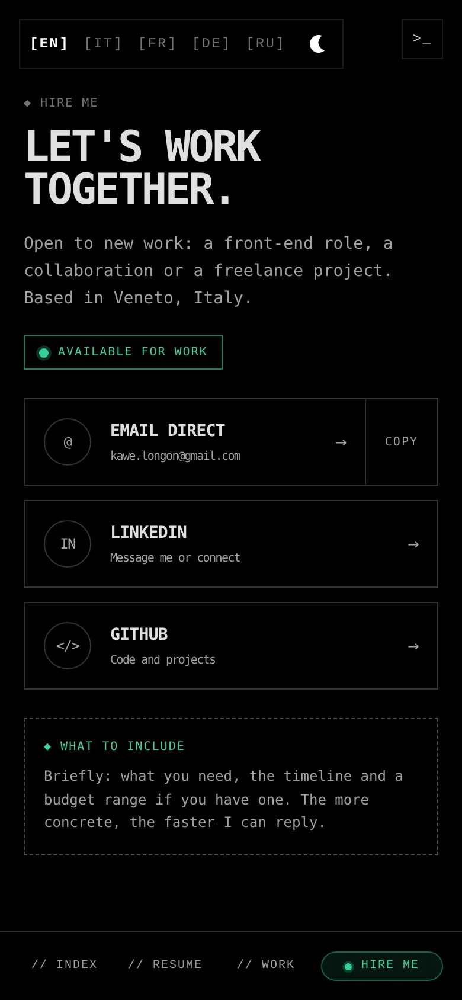</td>
  </tr>
  <tr>
    <td align="center"><sub>Home</sub></td>
    <td align="center"><sub>Resume</sub></td>
    <td align="center"><sub>Work</sub></td>
    <td align="center"><sub>Hire me</sub></td>
  </tr>
</table>

<br>

## Features

### Pages

| Page | URL | What it has |
| --- | --- | --- |
| **Home** | `/` | Name, role and handwritten signature. |
| **Resume** | `/resume` | Portrait and pitch, key figures, experience, key projects with links to case study, live site and code, education, stack (a dot marks the tools used most), languages, CV download. Facts are in `data/resume.ts`, text in `data/resumeCopy.ts`. `/timeline` redirects here. |
| **Work** | `/projects` | Project list with desktop floating previews and phone screenshots on mobile. |
| **Case study** | `/projects/<slug>` | Challenge, solution, highlights, role, stack, live site and source links. Written in all five languages. |
| **Hire me** | `/contact` | Availability badge, copy-email button that answers on the cursor, LinkedIn and GitHub, and a project brief form. |

### Experience and design

- **Dark and light theme.** Follows the system setting until the visitor picks one with the sun/moon button or the terminal command `theme light`. The choice is saved and applied before the first paint, so there is no flash. Light colours are defined in `src/index.css`.
- **Animated theme toggle.** A sun and a moon that morph into each other.
- **Cursor as a tool.** Over links and buttons the dot grows into a label (`OPEN ↗`, `COPY`, `SAVE ↓`). Any element can set its own with `data-cursor="LABEL"`. Desktop only.
- **"Hire me" call to action.** A soft green pill in the menu that glows brighter on hover, and a button on the Resume page whose neon fill rises on hover.
- **Shared title transition.** A project title moves from its row into the case study page, and back, with Framer Motion `layoutId`.
- **Floating previews on desktop, screenshots on mobile.** Phone-sized screenshots are mounted only on mobile, so desktop never pays for them.
- **Scramble text.** Titles decode on load. Screen readers get the real text, and the effect is skipped for visitors who prefer reduced motion.
- **Terminal.** Press `/` (or tap `>_` on a phone) and type `help`: `projects`, `open`, `email`, `github`, `resume`, `lang`, `theme` and more. Loaded as a separate chunk only when opened.

### Content and reach

- **Five languages (EN, IT, FR, DE, RU).** Picked from the browser language on the first visit, remembered afterwards. Dates are formatted per language with `Intl`. The Resume link in the menu is short ("CV") on phones and complete on desktop.
- **Resume download.** Italian PDF for Italian, English PDF for the other languages, from the Resume page and the terminal.
- **Real URLs and SEO.** Every page has its own HTML at build time with title, description, canonical link and social preview, plus `sitemap.xml` and `robots.txt` (`vite-plugins/seo.ts`). The page content is also in the HTML for crawlers, hidden visually so nobody sees it flash before React starts. Old `/#/projects` links are redirected.
- **Accessible by default.** Skip link, `aria-current` navigation, labelled language switcher, visible keyboard focus, keyboard-friendly dropdowns, `prefers-reduced-motion` support, selectable text.

<br>

## Tech stack

| | |
| --- | --- |
| UI | [React](https://react.dev/) 19, strict [TypeScript](https://www.typescriptlang.org/) |
| Styling and motion | [Tailwind CSS](https://tailwindcss.com/) 4, [Framer Motion](https://www.framer.com/motion/) |
| Build | [Vite](https://vite.dev/) with a custom SEO plugin |
| Forms and email | Netlify Forms, a Netlify Function and [Resend](https://resend.com/) |
| Hosting | [Netlify](https://www.netlify.com/) |

Only two runtime dependencies besides React: `framer-motion` and `clsx`.

<br>

## Getting started

```bash
npm install
npm run dev        # development server
npm run build      # type-check + production build
npm run lint       # ESLint
npm run typecheck  # TypeScript only
npm run preview    # serve the production build locally
```

The contact form only works on the deployed site (see below): locally it shows the fallback message with the email address.

<br>

## Contact form and email

The brief form posts to a [Netlify Form](https://docs.netlify.com/forms/setup/) named `brief`, declared once in `index.html`. Every submission is kept in the Netlify dashboard (Forms → `brief`), with a honeypot field against spam bots.

A Netlify Function, `netlify/functions/submission-created.ts`, runs on each submission and sends a formatted email through Resend, with the sender as `reply-to` so you can answer straight from your inbox.

```text
visitor → form → Netlify Forms (stored) → submission-created function → Resend → your inbox
```

Setup:

1. In Netlify, open **Project configuration → Environment variables** and add `RESEND_API_KEY`.
2. Optional: `BRIEF_TO_EMAIL` (default `kawe.longon@gmail.com`) and `BRIEF_FROM_EMAIL` (default Resend's test sender, which can only write to the Resend account's own address until a domain is verified).
3. Deploy, send a test from the site, and check **Logs → Functions → `submission-created`** if nothing arrives.

If you keep a Netlify email notification (Forms → Form notifications) as well, you receive both emails.

<br>

## Project structure

```text
├── netlify/functions/         # submission-created: emails each brief through Resend
├── public/                    # Static assets (WebP images, CV PDFs, og-image.jpg, _redirects)
├── docs/screenshots/          # Images used by this README
├── vite-plugins/seo.ts        # Per-page HTML, sitemap and robots.txt at build time
└── src/
    ├── animations/            # Framer Motion variants
    ├── components/
    │   ├── contact/           # Availability badge, copy email, project brief form
    │   ├── resume/            # Hero, section layout, "Hire me" button
    │   ├── layout/            # Cursor, language switcher, theme toggle, navigation, hover preview, terminal, skip link
    │   ├── ui/                # Link, PageShell, ScreenshotImage, ScrambleText, Select
    │   ├── views/             # HomeView, ProjectsView, ProjectDetailView, ResumeView, ContactView
    │   └── ViewRouter.tsx     # Picks the view for the current URL
    ├── context/               # Layout (view + language + copy) and hover-preview state
    ├── data/                  # Content: projects, resume, contact, translations, case studies, SEO
    ├── hooks/                 # useLayout, useRoute, usePointer, useMediaQuery, usePreview, useTheme
    ├── lib/                   # cn, cursor, date formatting, language and theme persistence, navigation
    ├── routes.ts              # View ids and their URL paths
    └── types.ts               # Shared types (Translation, Project, ResumeCopy, ...)
```

Content that does not change between languages (URLs, images, dates) lives in `data/projects.ts` and `data/resume.ts`. Only the text lives in `data/translations.ts`, `data/caseStudies.ts` and `data/resumeCopy.ts`, keyed by id.

<br>

## Adding content

**A project**

1. Add its id to `ProjectId` in `src/types.ts`.
2. Add `{ id, slug, url, repo?, stack, image, mobileImage? }` to `src/data/projects.ts` (images are `{ src, width, height }`). Put the desktop picture in `public/` (WebP, 1400x840); `mobileImage` is an optional phone picture, and without it mobile shows the desktop one.
3. Add `title` and `desc` under `projects.items` for every language in `src/data/translations.ts`.
4. Add the case study text in `src/data/caseStudies.ts` (English is required, other languages fall back to it when missing).

TypeScript reports an error until every language has the new entry.

**A Resume entry** (job, key project or education): add its id to the matching type in `src/types.ts`, its facts to `src/data/resume.ts` and its text for every language to `src/data/resumeCopy.ts`.

**A language**

1. Add the code to `Language` in `src/types.ts` and an entry to `LANGUAGES` in `src/data/languages.ts`.
2. Add a full `Translation` object to `src/data/translations.ts`, a `ResumeCopy` to `src/data/resumeCopy.ts`, and a resume file in `src/data/contact.ts`.

**Availability.** Set `AVAILABLE_FOR_WORK` in `src/data/contact.ts` to `false` when you are fully booked: the badge on the contact and Resume pages turns grey and says so.

<br>

## Performance

- Images in `public/` went from about 11 MB to under 1 MB (WebP, resized to what the layout can display).
- Mouse tracking uses Framer Motion values, so moving the mouse does not re-render React.
- Mobile screenshots are lazy-loaded and only mounted on mobile. The hover preview image loads on first hover.
- The terminal is a separate chunk, loaded only when opened.
- The theme is set by a tiny inline script before the first paint, so there is no flash and no layout shift.

<br>

## Deploying on Netlify

`public/_redirects` sends `/timeline` to `/resume` and unknown paths to `index.html`, so a deep link such as `/projects/scaletta` works even for pages that are not pre-generated. The site address used in canonical links, the sitemap and social previews is `SITE_URL` in `src/data/site.ts`: change it if the domain changes.

For the contact form to work, the site must be deployed once with Form detection enabled (Netlify detects `brief` while building), and `RESEND_API_KEY` must be set (see [Contact form and email](#contact-form-and-email)).

<br>

<div align="center">
  <sub>Designed and built by <a href="https://www.linkedin.com/in/kawe-longon-810b94248/">Kawe Longon</a> · <a href="https://github.com/KaweAW">GitHub</a></sub>
</div>
