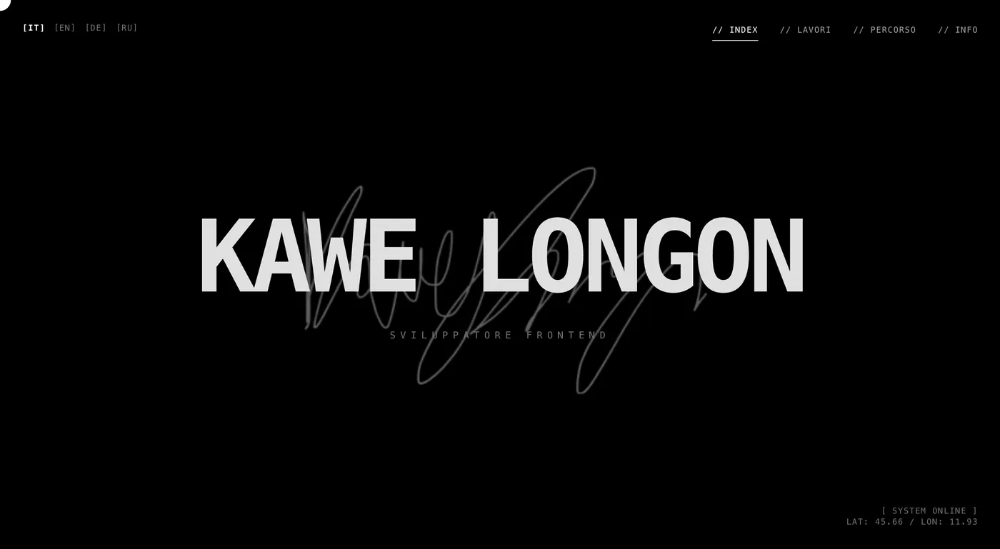

# Kawe Longon | Interactive Portfolio

A minimalist, brutalist-inspired interactive portfolio built with **React 19**, **TypeScript**, **Tailwind CSS 4** and **Framer Motion**. Designed to feel like a digital canvas or a high-end terminal, focusing on typography, fluid animations, and a seamless user experience.



## Features

- **Brutalist & minimalist UI:** monospace typography, grid-based layout.
- **Dark and light theme:** follows the system setting (`prefers-color-scheme`) until the visitor picks one with the `[◐]` button or the terminal command `theme light`. The choice is saved, and the theme is set before the first paint so there is no flash. Colours are swapped in `src/index.css` (the site uses black/white/neutral utilities, the light theme redefines them).
- **Contact page:** availability badge (`AVAILABLE_FOR_WORK` in `src/data/contact.ts`), copy-email button that answers on the cursor, links, and a project brief form. The form posts to a Netlify form declared in `index.html`: in the Netlify dashboard open Forms > `brief` > Settings & usage > Form notifications to get each message by email.
- **Cursor as a tool:** over links and buttons the dot grows into a label (`OPEN ↗`, `COPY`, `SAVE ↓`...). Any element can set its own with `data-cursor="LABEL"`. Desktop only.
- **Timeline overview:** a line above the list places every entry at its real date; it follows the list while scrolling or hovering, and each dot jumps to its entry.
- **Shared title transition:** the project title moves from its row into the case study page (and back) with Framer Motion `layoutId`.
- **Mobile screenshots:** each project shows a phone-sized screenshot on mobile (tall ones scroll through as you scroll). Rendered only on mobile, so desktop never pays for it.
- **Desktop floating previews:** the desktop screenshot follows the cursor on hover (and keyboard focus) with a spring.
- **Real URLs:** `/`, `/projects`, `/projects/<project>`, `/timeline` and `/contact`. Old `/#/projects` links are redirected. The build writes one HTML file per page with its own title, description, canonical link and social preview, plus `sitemap.xml` and `robots.txt` (`vite-plugins/seo.ts`).
- **Case study page per project:** challenge, solution, highlights, role, stack and links to the live site and the source code. Text is in all five languages.
- **Terminal:** press `/` (or tap `>_` on a phone) and type `help`. Loaded as a separate chunk only when opened.
- **Scramble text effect:** text decoding animation for titles. Screen readers get the real text, and it is skipped for visitors who prefer reduced motion.
- **Five languages (EN, IT, FR, DE, RU):** picked from the browser language on first visit, remembered afterwards. Dates are formatted per language with `Intl`.
- **Resume download:** Italian or English PDF depending on the selected language.
- **Accessible by default:** skip link, `aria-current` navigation, labelled language switcher, visible keyboard focus, `prefers-reduced-motion` support, selectable text.

## Tech stack

- [React](https://react.dev/) 19 with strict [TypeScript](https://www.typescriptlang.org/)
- [Vite](https://vite.dev/)
- [Tailwind CSS](https://tailwindcss.com/) 4
- [Framer Motion](https://www.framer.com/motion/)

## Getting started

```bash
npm install
npm run dev        # development server
npm run build      # type-check + production build
npm run lint       # ESLint
npm run typecheck  # TypeScript only
npm run preview    # serve the production build locally
```

## Project structure

```text
├── public/                    # Static assets (images WebP, og-image.jpg, _redirects)
├── vite-plugins/seo.ts        # Per-page HTML, sitemap and robots.txt at build time
└── src/
    ├── animations/            # Framer Motion variants
    ├── components/
    │   ├── contact/           # Availability badge, copy email, project brief form
    │   ├── timeline/          # Timeline overview axis
    │   ├── layout/            # Cursor, language switcher, theme toggle, navigation, hover preview, terminal, skip link
    │   ├── ui/                # Link, PageShell, ParallaxImage, ScreenshotImage, ScrambleText
    │   ├── views/             # HomeView, ProjectsView, ProjectDetailView, TimelineView, ContactView
    │   └── ViewRouter.tsx     # Picks the view for the current URL
    ├── context/               # Layout (view + language + copy) and hover-preview state
    ├── data/                  # Content: projects, timeline, contact, translations, languages
    ├── hooks/                 # useLayout, useRoute, usePointer, useMediaQuery, usePreview
    ├── lib/                   # cn, date formatting, language detection/persistence
    ├── routes.ts              # View ids and their URL paths
    └── types.ts               # Shared types (Translation, Project, TimelineEntry, ...)
```

Content that does not change between languages (URLs, images, dates) lives in `data/projects.ts` and `data/timeline.ts`. Only the text lives in `data/translations.ts`, keyed by id.

## Adding content

**A project**

1. Add its id to `ProjectId` in `src/types.ts`.
2. Add `{ id, slug, url, repo?, stack, image, mobileImage? }` to `src/data/projects.ts` (images are `{ src, width, height }`). Put the desktop picture in `public/` (WebP, 1400x840); `mobileImage` is an optional phone picture, and without it mobile shows the desktop one.
3. Add `title` and `desc` under `projects.items` for every language in `src/data/translations.ts`.
4. Add the case study text in `src/data/caseStudies.ts` (English is required, every other language falls back to it when missing).

TypeScript reports an error until every language has the new entry. Timeline entries work the same way with `TimelineId`, `data/timeline.ts` and `timeline.items`.

**A language**

1. Add the code to `Language` in `src/types.ts` and an entry to `LANGUAGES` in `src/data/languages.ts`.
2. Add a full `Translation` object to `src/data/translations.ts`, and a resume file in `src/data/contact.ts`.

## Performance notes

- Images in `public/` went from about 11 MB to under 1 MB (WebP, resized to what the layout can display).
- Mouse tracking uses Framer Motion values, so moving the mouse does not re-render React.
- Mobile parallax images are lazy-loaded and only mounted on mobile; the hover preview image loads on first hover.
- Only two runtime dependencies besides React: `framer-motion` and `clsx`.

## Deploying on Netlify

`public/_redirects` sends unknown paths to `index.html`, so a deep link such as `/projects/scaletta` works even for pages that are not pre-generated. The site address used in canonical links, the sitemap and social previews is `SITE_URL` in `src/data/site.ts`: change it if the domain changes.
